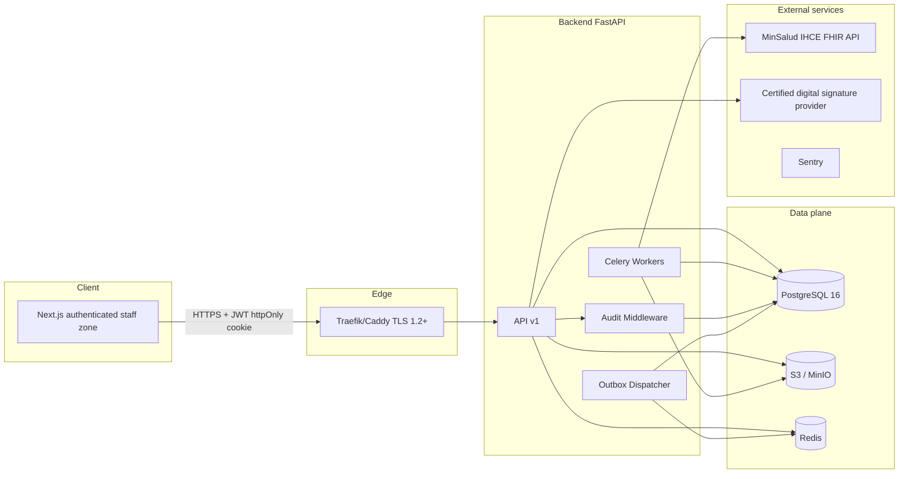

# AI Clinic Operations Copilot — Compliance-First Dental EHR for Colombia

## The Problem Worth Solving

In Colombia, a dental health record is not a simple medical form. Legally, it must be a **private, chronological, confidential, traceable, signable, long-term preserved, and interoperable** record. Many dental practices still rely on paper records or administrative systems that do not comply with electronic health record requirements, personal data protection, or national healthcare interoperability.

The stakes are existential for clinic owners:

- Fines of up to **2,000 SMLMV** for non-compliance
- Suspension of activities or temporary/definitive closure by health authorities
- The **April 15, 2026 deadline** for IHCE integration via FHIR RDA (Resolution 1888/2025) has already passed — clinics without integration are already out of compliance

**AI Clinic Operations Copilot** is a dedicated platform that digitizes dental clinical records for a single Colombian clinic, enforcing Colombian health and data-protection law by design. The pitch is blunt: **"Operate legally or close."** The clinic does not need to become a legal expert — the platform imposes compliance at every step.

This is not a traditional CRUD application. It solves problems that rarely exist in typical web apps:

- Clinical records that **cannot be overwritten** once signed
- Corrections that must be **added without deleting** the original information
- Health information treated as **sensitive personal data**
- Access restricted by **role and clinical purpose**
- Auditing of reads, writes, exports, and corrections
- Official catalogs for diagnoses, procedures, municipalities, countries, and occupations
- Generation of **RDA resources in FHIR format** for interoperability with the Ministry of Health IHCE platform

---

# Impact

## The Compliance Gap Is a Business Risk, Not a Feature Request

For a Colombian dental clinic owner, regulatory non-compliance is not an abstract IT problem — it is a direct threat to the license to operate. The platform addresses:

1. **Legal risk** — Paper records and non-compliant systems expose clinics to sanctions from the Ministry of Health, Superintendencia Nacional de Salud, SIC, and departmental health secretariats
2. **Interoperability deadline** — RDA FHIR submission to IHCE is mandatory; the platform automates bundle construction and VIDA acknowledgment
3. **Consent chaos** — Paper consent forms with illegible signatures and no audit trail cannot survive a SIC inspection
4. **Patient rights** — Law 2015 requires free, timely delivery of the complete health record; the platform provides traceable in-clinic PDF export
5. **Operational loss** — Without centralized electronic records, patient continuity depends on informal agendas and tribal knowledge

## Value Proposition by Stakeholder

| Stakeholder | Value |
|-------------|-------|
| Clinic owner / admin | Verifiable legal peace of mind; compliance dashboard with signed records, RDA/VIDA status, retention archive state; audit-ready exports |
| Dentist | One screen per visit: patient data, clinical sections, CUPS treatment plan, FDI odontogram, certified digital signature — no paper, no duplication |
| Dental assistant | Clear support workflow: prepares visits, records under supervision, never signs |
| Receptionist | Minimal admission form validated against official catalogs (DANE); consent capture support; no access to clinical content |
| Patient | No account required; requests HC copy in person; admin generates PDF and delivers on physical media with full audit trail |

---

## Regulations Covered (Product Requirements, Not Footnotes)

These are not marketing badges — they are **hard constraints** encoded into business rules R1–R13:

| Regulation | What the platform must enforce |
|------------|-------------------------------|
| **Law 2015/2020** | Interoperable EHR, patient ownership, digital signatures, free record delivery, immutable records with traceable corrections |
| **Law 1581/2012** | Personal data protection, health data as sensitive, prior consent, ARCO rights, controller responsibilities |
| **Resolution 1995/1999** | Health record management, restricted access, chronological integrity, signed clinical annotations |
| **Resolution 839/2017** | 15-year minimum retention: 5 years active archive + 10 years central archive |
| **Resolution 866/2021** | Interoperable clinical datasets, official catalogs, privacy by design |
| **Resolution 1888/2025** | Digital Healthcare Summary (RDA), HL7 FHIR, submission to IHCE, VIDA acknowledgment |

---

## The Big Picture: How It All Works

At its core, the platform follows a compliance-first clinical operations loop:

**1. Admit & Consent** → Receptionist registers patient with minimal admission master data (DANE-validated) → Patient grants consent in-clinic on tablet with staff witness → Signature stored with HMAC + audit trail

**2. Clinical Visit** → Dentist opens a clinical folio (draft) → Documents visit in structured JSON sections + FDI odontogram → Closes with certified digital signature (PKCS#7/CAdES via Colombian CA token)

**3. Interoperate** → Signed visit triggers RDA FHIR bundle construction → Submitted to MinSalud IHCE → VIDA stored as proof of acceptance

**4. Govern** → Immutable audit log on every sensitive operation → Retention classifier moves records through archive stages → Admin exports for authorities or delivers HC copy to patient in person

```
Staff (Next.js) → API (FastAPI) → PostgreSQL + S3 + Redis
                                      ↓
                              Celery workers → IHCE FHIR API
                                            → PDF export (WeasyPrint)
                                            → Retention jobs
```

**Deployment model:** Dedicated single-tenant instance for one dental clinic (not multi-client SaaS in V1). One organization, one production tenant.

---

## Non-Negotiable Business Rules (R1–R13)

These rules are absolute. No feature, shortcut, or technical decision can violate them:

- **R1 — Append-only clinical records.** Signed records are never modified or deleted. Corrections are new folios referencing the original.
- **R2 — Prior informed consent.** No clinical folio without valid data-treatment consent.
- **R3 — Certified digital signature.** Treating professional signs with Colombian CA token (Certicámara, Andes SCD).
- **R4 — 15-year retention minimum.** 5 years active + 10 years central archive before eligible disposal.
- **R5 — Free HC delivery.** Patient receives complete record in person; admin generates PDF with witness audit.
- **R6 — No data commercialization.** Clinical data never sold, shared, or used to train external models.
- **R7 — Immutable audit trail.** Every operation on clinical data logged with user, action, entity, before/after, IP, timestamp.
- **R8 — RDA to MinSalud after each signed visit.** `BundleAmbulatoryRDA` → `$enviar-rda-consulta` → VIDA stored.
- **R9 — No direct UPDATE/DELETE on clinical data.** Only law-defined transformations: traceable correction, consent revocation, final disposal.
- **R10 — RBAC with least privilege.** Admin, dentist, assistant, receptionist — each role strictly scoped.
- **R11 — Clinic data isolation.** Single tenant in production; data, files, events, and audit belong exclusively to that clinic.
- **R12 — Privacy by design and default.** Most restrictive settings first; no PII in logs or error responses.
- **R13 — AI-ready without coupling.** MVP has no AI agents, but architecture allows future copilot without AI writing directly to the HC.

---

## Architecture and Technology Stack

### High-Level Components

- **Frontend:** Next.js 16 (App Router), React 19, TypeScript strict, Tailwind 4, shadcn/ui, TanStack Query 5
- **Backend:** Python 3.12, FastAPI, Pydantic v2, SQLAlchemy 2.x async, Alembic
- **Database:** PostgreSQL 16 with `pgcrypto`, `pgvector`, `citext`, `uuid-ossp`
- **Jobs:** Celery + Redis (RDA retries, outbox dispatch, retention classifier)
- **Storage:** S3-compatible (MinIO dev, S3/R2 prod) for radiographs, consent images, FHIR bundles
- **Contracts:** OpenAPI as single source of truth → `openapi-typescript` + Zod on frontend
- **PDF:** WeasyPrint + Jinja2 for in-clinic HC export
- **FHIR:** `fhir.resources` R4 with Colombia RDA CO profiles
- **Local infra:** Docker Compose (api, worker, celery-scheduler, frontend, postgres, redis, minio)
- **Quality:** pytest, Vitest, Playwright e2e, GitHub Actions CI, Ruff, mypy, ESLint

### Backend Architecture Philosophy

**Vertical slices, not horizontal layers.** Each domain lives in its own module:

```
backend/app/
├── api/           # Thin HTTP controllers — validate, authorize, delegate
├── platform/      # Cross-cutting: auth, audit, outbox, organization (never imports modules/)
└── modules/       # Product domains: patients, clinical_records, consents, rda, odontograms, exports
```

**Rule:** `api` → `application` (use cases) → `repositories` → database. No SQLAlchemy in routers. No business logic in HTTP layer.

**Frontend boundaries:** `features/` cannot import across features; all API calls through `lib/platform/api/client.ts` (`staffClient` with JWT + refresh + `X-Correlation-Id`).

### System Design



The frontend never talks directly to external services (except the local signature provider bridge on the professional's machine). All third-party communication goes through the backend with RBAC, audit, and validation.

---

## Core Workflows

### W1 — Patient Admission
Receptionist registers patient with mandatory admission master: ID document, names, birth date, sex, DANE location, contact. Catalog validation against DANE. Legal representative required for minors. No clinical content access for receptionist role.

### W2 — In-Clinic Consent (Tablet)
Patient reads legal HTML (sanitized with DOMPurify), signs on tablet. Staff authenticated as witness. Server stores PNG signature + HMAC-SHA256 over canonical material. No clinical folio can open without valid `data_treatment` consent.

### W3 — Clinical Visit (Folio Lifecycle)
1. Dentist opens draft folio (`POST /clinical-records`)
2. Fills structured sections: user identification, clinical narrative, CUPS treatment plan, odontogram attachments
3. Draft persisted as encrypted JSON (`draft_document_encrypted`)
4. On close: server issues sign challenge → client signs with CA token (PKCS#7) → server verifies chain, CRL/OCSP, identity
5. Signed document frozen in `clinical_signed_documents`; draft cleared; outbox event `clinical_record.signed` enqueued

### W4 — Traceable Rectification
Error in signed folio? Dentist opens **new folio** (`clinical_addendum`) referencing original with reason. Original remains visible and intact. Both appear in HC timeline. New folio gets its own RDA submission.

### W5 — RDA FHIR Submission to IHCE
1. Outbox triggers `jobs.rda_sender.build_and_submit`
2. `build_bundle.py` constructs `BundleAmbulatoryRDA` from signed document + MPI + practitioner RETHUS + REPS
3. OAuth2 Client Credentials (Microsoft Entra ID) + `$enviar-rda-consulta`
4. VIDA stored on 200 acceptance; 5xx retried; 4xx requires human correction
5. Post-VIDA corrections use `$enviar-nota-aclaratoria`
6. Dev mode: `MINSAL_MODE=mock` without network

### W6 — In-Clinic HC Delivery to Patient
Patient requests copy in person. Admin confirms patient presence + delivery medium (USB, print). `generate_patient_export` builds complete PDF (all folios, rectifications, odontogram, consents, images) with SHA-256 hash. Audit log records witnesses and medium. No remote download, no magic-link, no patient portal in V1.

### W7 — Retention & Final Disposal
Daily Celery job classifies records: active archive (0–5 years) → central archive (5–15 years) → eligible for disposal. Compliance officer proposes; admin approves. Signed disposal act PDF generated; soft-delete with audit; notification to health secretariat.

---

## Decision #1: Append-Only Clinical Records (Not CRUD)

**The naive approach:** Standard UPDATE/DELETE on clinical records with an "edit history" table.

**Why that fails:** Colombian law requires that signed clinical information is immutable. Corrections must be additive and traceable — the original must remain visible forever.

**My solution:** Folio-based model. Each visit is a numbered folio in a patient's clinical history folder. Draft → signed is a one-way transition. Rectifications are new folios with `rectifies_record_id`, never in-place edits.

**Trade-off:** More complex UX (users see original + correction side by side) and more storage. But audit-ready and legally defensible.

---

## Decision #2: Certified Digital Signature via Client-Side Token

**The challenge:** Professional signatures must use Colombian CA-certified tokens (Certicámara, Andes SCD). Private keys never leave the token.

**The flow:**
1. Server canonicalizes draft JSON → SHA-256 challenge + nonce
2. Browser invokes CA provider bridge/extension to sign with token
3. PKCS#7/CAdES detached artifact sent to server
4. Server verifies signature chain, revocation (CRL/OCSP), identity match
5. Only on success: record promoted to `signed`, RDA job enqueued

**Trade-off:** Requires browser extension and physical token — friction by design. Simple e-signature would be legally insufficient.

---

## Decision #3: OpenAPI as Contract Single Source of Truth

**The problem:** FastAPI backend and Next.js frontend must stay in sync across dozens of endpoints with strict Pydantic schemas.

**My solution:** FastAPI auto-generates OpenAPI → `openapi-typescript` generates TypeScript types → `openapi-zod-client` generates Zod validators → `@zodios/core` typed client.

**Impact:** Schema changes break the frontend build immediately instead of at runtime in production. `just sync-contracts` regenerates everything.

---

## Decision #4: Transactional Outbox for RDA and Side Effects

**The problem:** Signing a clinical record must atomically persist the signed document AND reliably trigger RDA submission — even if IHCE is temporarily down.

**My solution:** `outbox_events` table written in the same transaction as the sign operation. Celery dispatcher polls outbox, enqueues `rda_sender` job with durable retries.

**Trade-off:** Eventual consistency for IHCE submission (seconds to minutes). But no lost RDAs on transient failures.

---

## Decision #5: Column-Level Encryption for Sensitive Fields

**The approach:** `pgcrypto` + AES-GCM with rotatable `ENCRYPTION_KEY_FIELD_AES`. Draft documents stored as `draft_document_encrypted`. Consent signature HMAC uses same key material.

**Why not encrypt everything:** Performance and queryability for non-sensitive metadata (folio numbers, timestamps, status). Encryption applied where law and threat model demand it.

---

## Decision #6: Regulatory Catalogs as First-Class Data

CIE-10 (diagnoses), CUPS (procedures), CUM (medications), CIUO (occupations), ISO 3166 (countries), DANE (departments/municipalities) are versioned reference tables — not free-text fields where the law requires a catalog.

Patient admission validates `residence_municipality_code` against DANE. Treatment plans reference CUPS codes. RDA bundles embed catalog-coded resources.

---

## Decision #7: Vertical Slice Architecture (Not Layer-First)

**Rejected:** Global `services/`, `repositories/`, `schemas/` folders.

**Chosen:** `modules/<domain>/` with `application/`, `models/`, `presentation/` per domain. `platform/` for cross-cutting (auth, audit, outbox, organization).

**Why:** Prevents circular imports, keeps tenant isolation enforceable per module, and makes it obvious where new clinical features belong. Lint rules enforce import boundaries (`no-restricted-imports` between `features/*` on frontend too).

---

## Security Implementation

| Layer | Control |
|-------|---------|
| Authentication | JWT (15 min access, 7 day refresh in httpOnly cookie), Argon2id passwords, MFA TOTP mandatory for professionals and admins |
| Authorization | RBAC with `requires()` decorator; permissions scoped per role (admin, professional, assistant, receptionist) |
| Audit | `@audited` decorator on state mutations; `@audited_read` on sensitive reads; `audit_logs` INSERT-only at DB role level |
| Encryption | TLS 1.2+, AES-GCM column encryption, draft documents encrypted at rest |
| Privacy | No PII in logs, Sentry `beforeSend` redaction, no patient remote access in V1 |
| Signature | PKCS#7 verification server-side; consent HMAC with witness metadata |
| Frontend | DOMPurify for legal HTML; CSP allows CA bridge only during signing flow |

---

## Domain Model (Business Entities)

- **Organization (tenant)** — Single clinic in production V1
- **Branch (sede)** — Physical location; each visit tied to a branch
- **Professional** — Dentist with RETHUS credentials and CA signing token
- **Patient** — HC owner; no account; in-person copy delivery only
- **Clinical History (carpeta)** — Chronological folder of folios per patient
- **Clinical Folio** — Atomic signable unit: initial assessment, follow-up, re-entry, or rectification addendum
- **Odontogram** — FDI-compliant dental chart with longitudinal versioning
- **Consent** — Signed authorization for data treatment or specific procedures; revocable
- **RDA** — FHIR ambulatory care summary sent to IHCE
- **VIDA** — IHCE acknowledgment identifier proving RDA acceptance
- **Patient Export** — SHA-256 hashed PDF of complete HC for in-clinic delivery
- **Audit Event** — Immutable log entry for every sensitive operation
- **Retention Event / Disposal Record** — Archive stage transitions and final disposition acts

---

## Compliance KPIs (Green or the Clinic Closes)

| Metric | Target |
|--------|--------|
| Signed clinical records with valid certified digital signature | **100%** |
| Visits with RDA submitted and VIDA received | **≥ 99%** |
| Valid consents before clinical attention | **100%** |
| ARCO requests answered within legal SLA | **100%** |
| Records with complete audit trail | **100%** |

---

## Current Status

**Active development.** Core platform implemented:

- Security, authentication, MFA, RBAC
- Immutable audit trail
- Regulatory catalogs (CIE-10, CUPS, CUM, CIUO, ISO 3166, DANE)
- Patient management with admission master
- Electronic health records (folio model, draft → sign lifecycle)
- FDI odontogram with versioning
- In-clinic consent management (tablet flow)
- HC export (PDF generation for in-clinic delivery)
- RDA FHIR interoperability (bundle construction, IHCE submission, VIDA tracking)

**Remaining work:** Feature polish and operational runbooks (backup, monitoring, disaster recovery).

### Production AWS deployment

The platform runs on production-grade AWS infrastructure:

| Component | Service |
|-----------|---------|
| Compute | Amazon EC2 |
| Database | Amazon RDS PostgreSQL |
| Object storage | Amazon S3 |
| Container registry | Amazon ECR |
| Identity | IAM Roles |
| Networking | Elastic IP |
| TLS | Caddy + Let's Encrypt |
| CI/CD | GitHub Actions |

**Deployment pipeline:** Git Push → GitHub Actions → Docker Build → Amazon ECR → EC2 → Docker Compose → Production

This is the author's first and only project deployed end-to-end to AWS.

**Explicitly out of scope for V1:** Patient portal, magic-link remote consent, AI agents/copilot, billing (DIAN), inventory, telemedicine, separate treatment plans module, multi-tenant SaaS.

---

## What Worked Well

1. **Constitution-driven development** — `mision.md` (business rules R1–R13) and `tech_stack.md` (technical constitution) as source of truth prevented scope creep and "convenient" shortcuts that would violate compliance
2. **Folio model** — Maps directly to how Colombian law thinks about clinical records (chronological, signable sheets)
3. **Outbox pattern** — Reliable RDA submission without coupling sign transaction to IHCE availability
4. **OpenAPI contract sync** — Frontend/backend type safety across a large API surface
5. **Docker Compose dev stack** — Full platform (API, worker, scheduler, frontend, postgres, redis, minio) runnable with `just dev`

---

## Lessons Learned

1. **Compliance is the product** — In regulated domains, "move fast and break things" is not an option. Every shortcut must be evaluated against legal rules before code is written.
2. **Law shapes the data model** — Append-only, rectification-as-new-record, and retention stages are not architectural preferences; they are legal requirements that become schema design.
3. **Friction is sometimes correct** — Certified token signing, in-clinic consent, and in-person HC delivery add UX friction that directly maps to legal validity.
4. **Interoperability is a pipeline, not an endpoint** — RDA generation involves FHIR profiling, OAuth2 to IHCE, retry policies, VIDA storage, and clarifying notes for post-acceptance corrections.
5. **Prepare for AI without building AI** — Event outbox, pgvector column, and stable application layer create hooks for a future operations copilot without compromising the compliance-first MVP.

---

## The Bottom Line

Building a "dental clinic app" sounds like standard healthcare CRUD. The reality is a **compliance engine disguised as an EHR**:

- Records are legal documents, not database rows
- Signatures are cryptographic proofs, not UI checkboxes
- Every read and write is auditable evidence
- Interoperability means FHIR bundles, OAuth2, and government API contracts
- Retention spans 15 years with formal disposal acts

**AI Clinic Operations Copilot** tackles these with pragmatic architecture: vertical slices for maintainability, append-only folios for legal immutability, outbox for reliable government integration, and OpenAPI contracts for type-safe full-stack development.

The platform ensures that a real Colombian dental clinic can operate legally with electronic health records — and provides the foundation for a future AI operations copilot that assists professionals without ever writing directly to the clinical record.

---

*Sources: product constitution (mision.md), technical constitution (tech_stack.md), project overview (AI_Clinic_Operations_Copilot_EN). Last updated: July 2026.*
